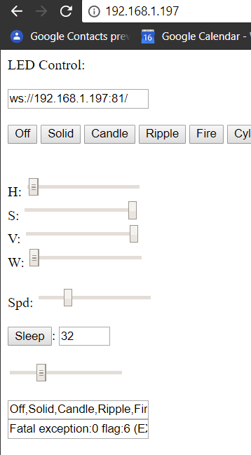

# ESP8266-LED-Websockets
Code for a ESP8266 controlled LED light with RGB + white SK2812 led strips.
This code makes it controllable from any webbrowser, with the files hosted on the ESP8266. So no external server needed.
Control via MQTT is also possible.
The current LED color is persistent and survives a reboot.
Maybe somebody with some experience can add some CSS code to the website to make it look somewhat nicer. For now it is very basic but functional.




## Basic usage
To use the program, make sure the following Arduino libraries are installed:
* Fastled
* Adafruit Neopixel 
* ESP libraries
* Websockets
* WifiManager

Connect your ledstrip to the ESP, remember the data GPIO pin used.
Update the ledstrip part of the code, set the amount of leds and the GPIO pin. You can also update the sort of controller, anything the Adafruit library supports should work.
Compile the code with at least 512kb of SPIFFS space (if this takes up too much space, remove everything from the data folder except index.htm)
Upload the code to a ESP8266. 
Use the following Arduino plugin to upload the data folder to the ESP as well:
https://github.com/esp8266/arduino-esp8266fs-plugin
Now, connect to wifi acces point setup by the ESP WifiManager library and use any webbrowser to goto http://192.168.4.1 and setup your wifi connection. Let the ESP connect, find out the ip address and goto that ip using the webbrowser. You can now control the leds using the sliders on the website.


## Animations
The website queries the ESP8266 to populate the list of supported animations. This query can later also be used by the MQTT system, so a possible home automation system can just query the ESP for the available animations. Animations can be added by adding a name and a function to the simpleanimationlist. 


## Websocket
The website shown to the user uses a websocket to send data to the ESP module. This feels very 'snappy', when manipulating the sliders the reaction is almost instant. You can of course also connect to the websocket server directly and send commands. Please check the index.htm file and the Ledwebsockets.h file for information on which commands can be send or received.

## RGBW strip support
I used my own way of hacking support into the firmware for the SK6812 led, which is a real nice RGBWW led with the white leds also individually adressable. Fastled has no support for this yet. The fastled library is used for all animations and calculations etcetera and the Adafruit Neopixel library is used to actually drive the leds. Which is a good enough compromise for now. The white leds of the strip are driven as one led, they can only be controlled by a seperate slider, so no calculating W from RGB, this is hard anyway because you have SK6812 leds with different color temperatures. But if anybody wants to use this anyway there is only one function where the code has to be changed.

## MQTT
There is basic MQTT support now as well. If you do not need MQTT, please comment out the #define USE_MQTT line in the ledcontrol.ino file.

First you define the mqtt server and the topics in the MQTTServer.h file.
At boot, the animationNames will be posted to the mqttAnimationNamesTopic.
Every time the state of the settings changes, via websocket or MQTT, a new status message will be posted with a JSON string in the mqttStatTopic.

``` {"animation":1,"r":0,"g":31,"b":0,"h":96,"s":255,"v":88,"white":0,"speed":50,"sleep":28}```

Commands can be send to the mqttCmdTopic path, for example "/livingroom/tree/cmd/hue".

The following commands can be used:

* hue: The brightness in HSB, value from 
* saturation: The brightness in HSB, value from 0 to 255.
* brightness: The brightness in HSB, value from 0 to 255.
* sleep: The time until fading out all leds, value from 1 to 1000;
* animation: The number of the animation to be selected (0 is off, 1 is solid, rest are animations).
* speed: The speed of the animation (does not do much yet).
* white: The intensity from 0-1023 of the white leds.
* hsv: Comma seperated HSV values ("128,94,16").
* rgb: Comma seperated RGB values ("128,128,128").


## TODO:
- Add config page to set settings instead of hard coding them.


##Development:
While further developing the website, it might be usefull to know you can run the website in the data folder from a computer as well and let it connect to an ESP running the software, just open the file using any webbrowser, and add the following to the URL: ?ip=*IP*. This saves you from uploading the data folder while developing the website.

This is still a WIP. The upload via Arduino IDE is broken...

This work was forked from https://github.com/TheAustrian/ESP8266-LED-Websockets/
